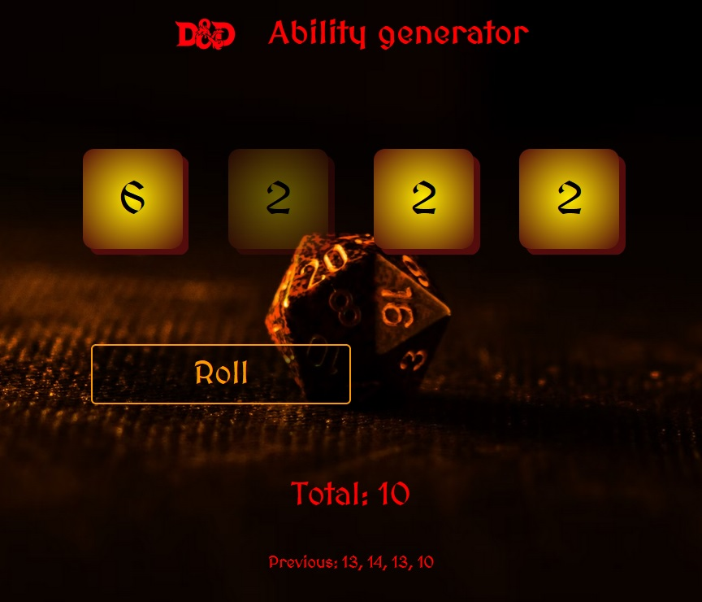

# DnD Ability Generator

The app helps with setting up starting abilities for DnD characters. It generates 4 random dice rolls, drops the lowest score and calculates the total. User can also reroll all 1s and get a new total. The app keeps track of previously generated totals.

## Table of contents

- [Overview](#overview)
  - [The challenge](#the-challenge)
  - [Screenshot](#screenshot)
  - [Links](#links)
- [My process](#my-process)
  - [Built with](#built-with)
  - [What I learned](#what-i-learned)
  - [Continued development](#continued-development)
- [Author](#author)
- [Acknowledgments](#acknowledgments)


## Overview

### The challenge

Users should be able to:

- Roll 4 dice and get the total for 3 highests scores.
- Reroll all the 1s.
- See the previous rolls totals (calculated after rerolling 1s)
- See a comment added if a total is particularily high or low.


### Screenshot




### Links

- Code: [Github](https://arniss5.github.io/DnD-ability-generator/)
- Live Site URL: [Github Pages](https://github.com/Arniss5/DnD-ability-generator)

## My process

### Built with

- Semantic HTML5 markup
- Mobile first approach
- Flexbox
- JavaScript

### What I learned

With this project I practised creating responsive applications. I also got more experience manipulating DOM and writing more complex JS functions. I learned .reduce() and Math.min().


```js
total = current_dice.reduce((a, b) => a + b, 0) - Math.min(...current_dice)
```
```js
for (let div of Array(...document.getElementsByClassName('dice'))) {
        if(div.textContent == Math.min(...current_dice)){
            div.classList.add('lowest')
            break
        } 
    }
```


### Continued development

I'm planning on starting to build bigger, more complex application. 

## Author

- Github - [Arniss5](https://github.com/Arniss5)


## Acknowledgments

galxrax rax for the background image. [galxrax rax's Unsplash](https://unsplash.com/@galxrax)

